# Chat-Toner Architecture Diagrams

**Generated:** 2026-01-03
**Purpose:** Visual architecture documentation

---

## 1. High-Level System Architecture

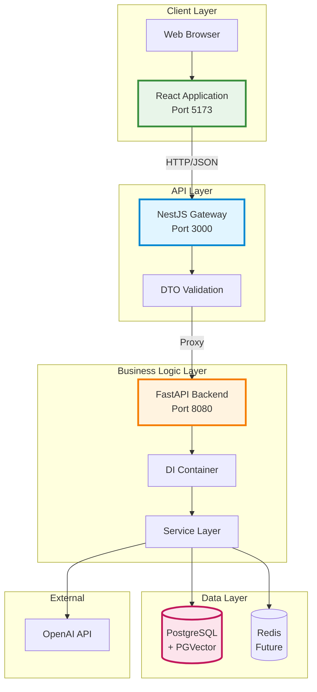

---

## 2. Detailed Component Diagram

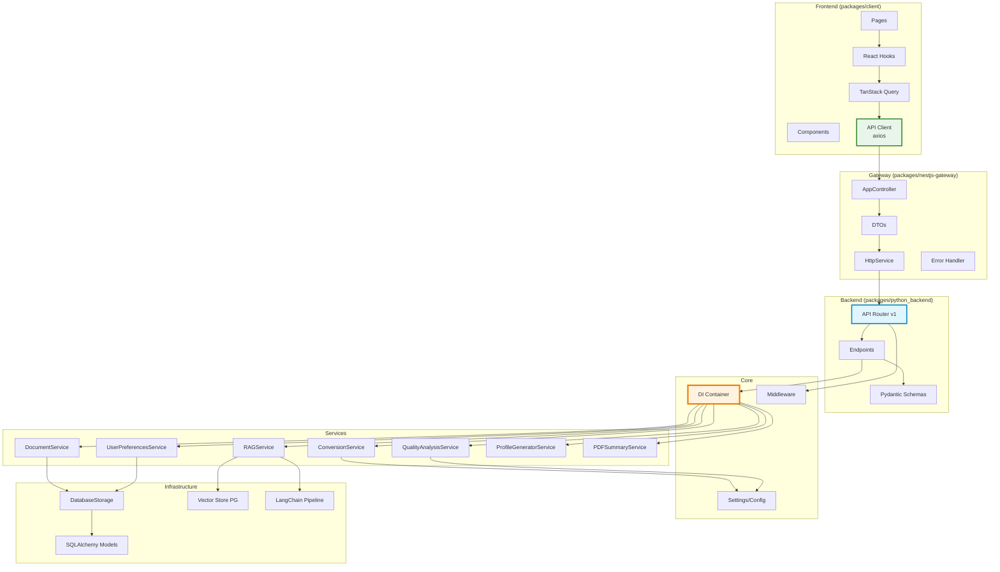

---

## 3. Layer Architecture (Python Backend)

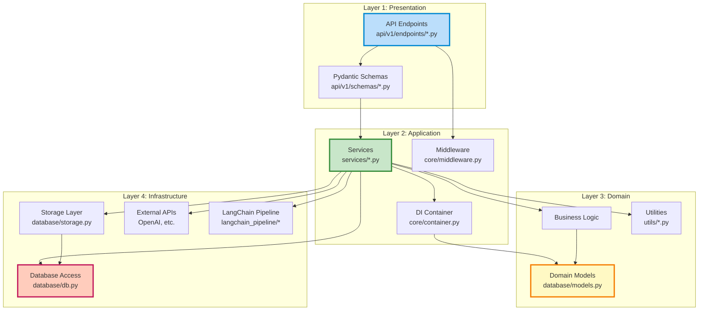

---

## 4. Request Flow Sequence

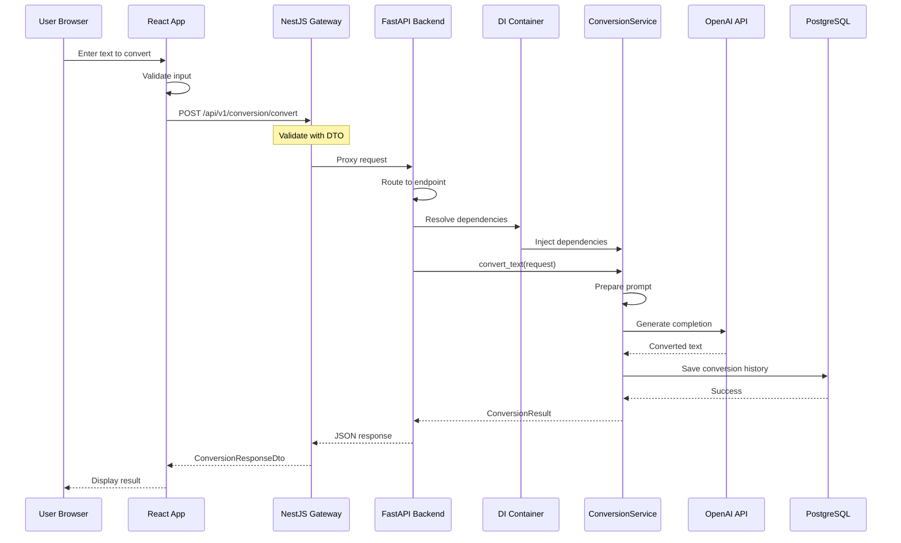

---

## 5. RAG Pipeline Architecture

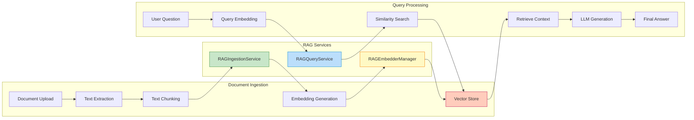

---

## 6. Dependency Injection Graph

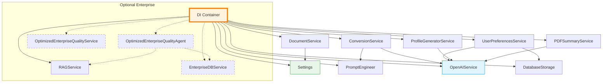

---

## 7. Data Model Relationships

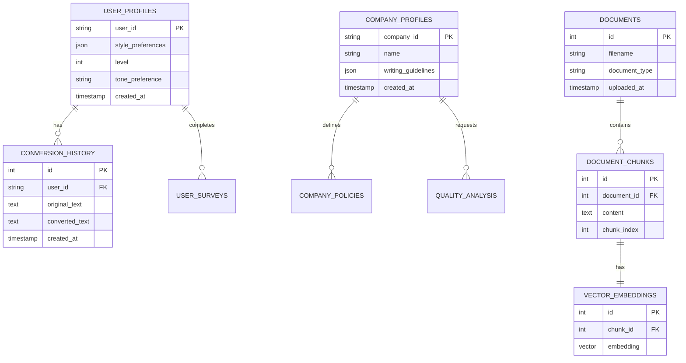

---

## 8. Deployment Architecture

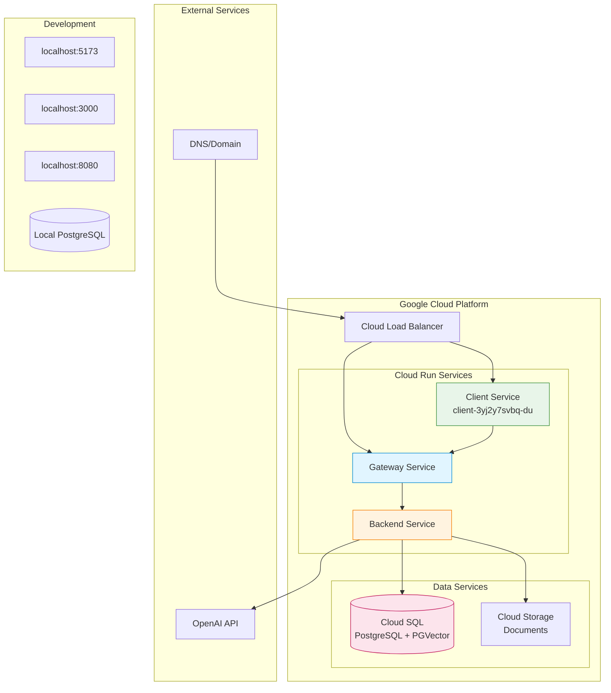

---

## 9. Error Handling Flow

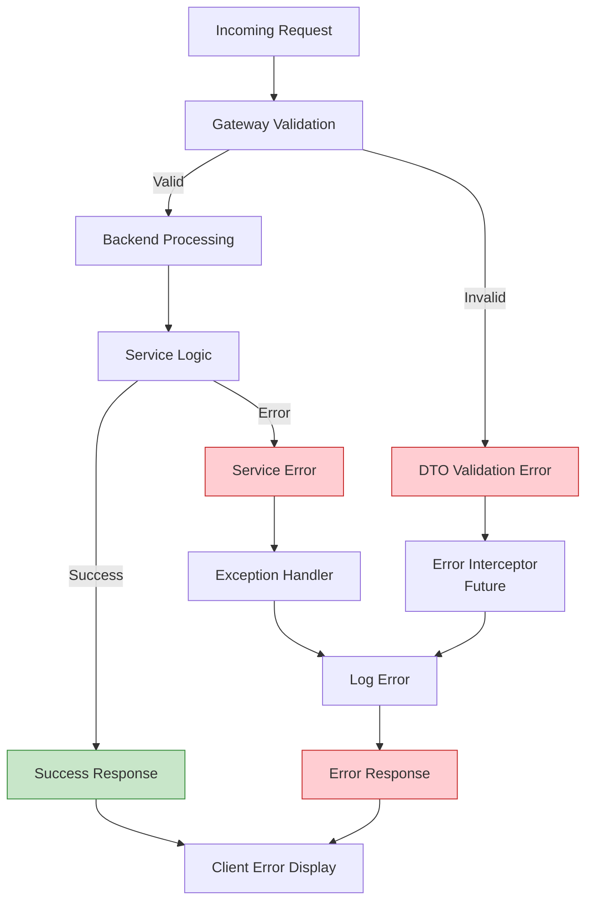

---

## 10. Monorepo Structure

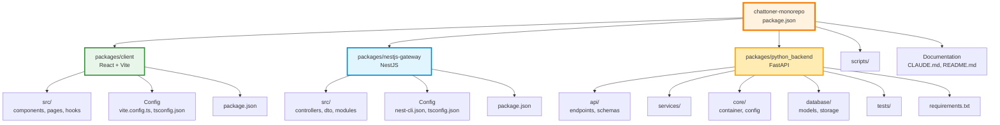

---

## 11. Service Communication Patterns

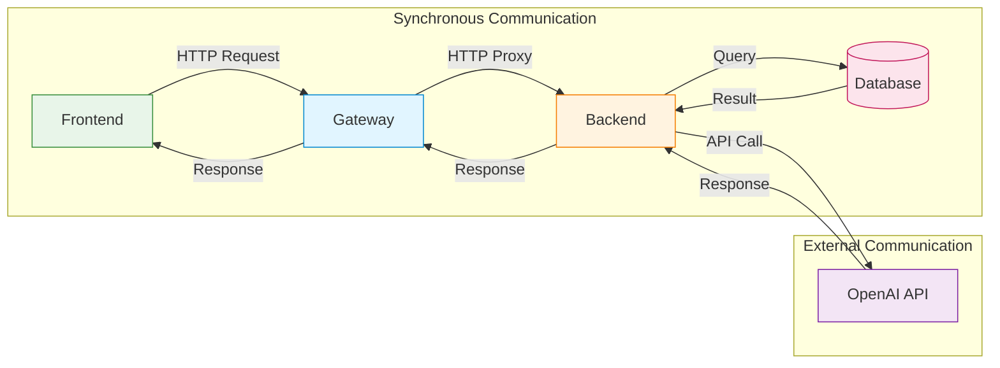

---

## 12. Security Architecture

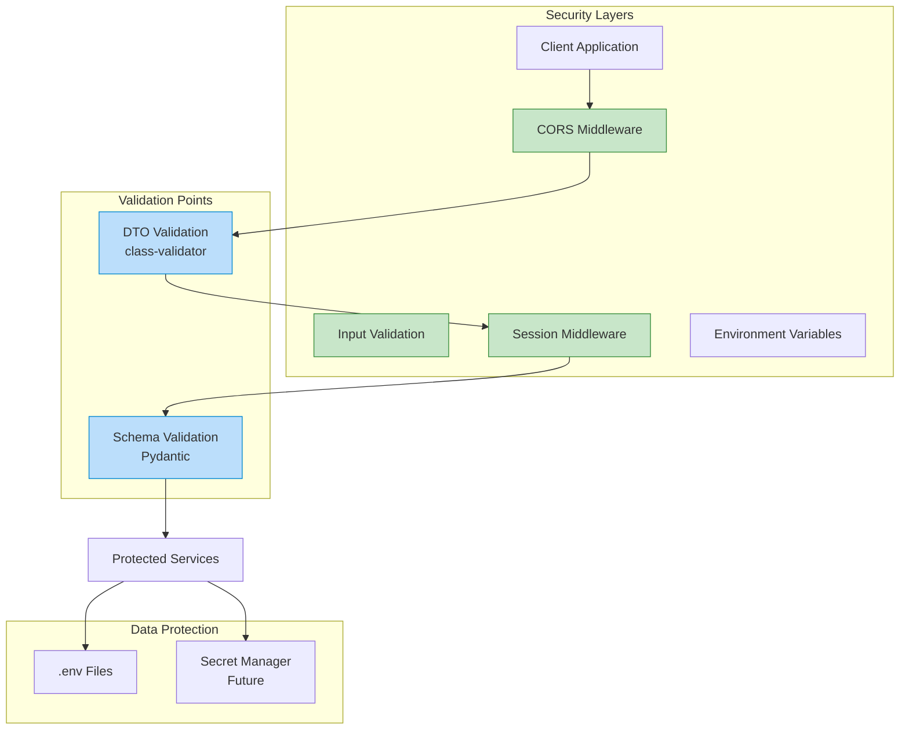

---

## Usage Notes

These diagrams provide visual documentation of the Chat-Toner architecture. They can be:

1. **Rendered** in any Mermaid-compatible viewer
2. **Embedded** in documentation
3. **Exported** to PNG/SVG for presentations
4. **Updated** as the architecture evolves

Refer to `ARCHITECTURE_REVIEW.md` for detailed analysis and `ARCHITECTURE_METRICS.md` for quantitative metrics.
