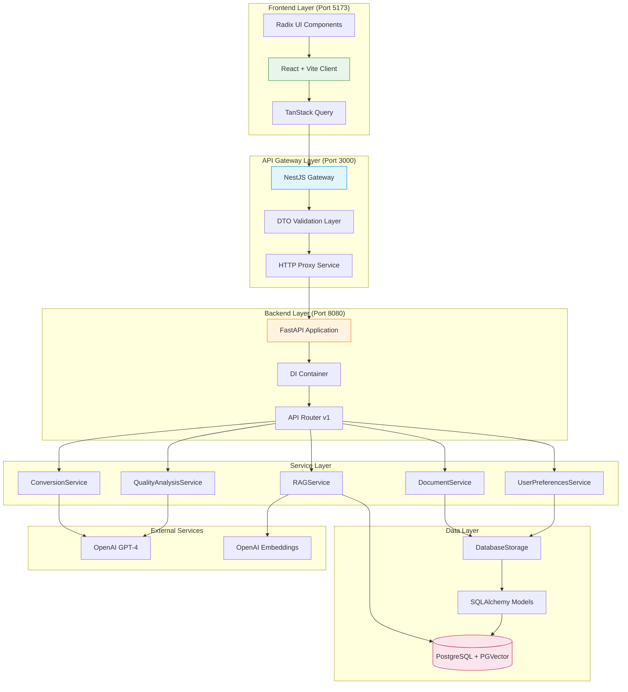
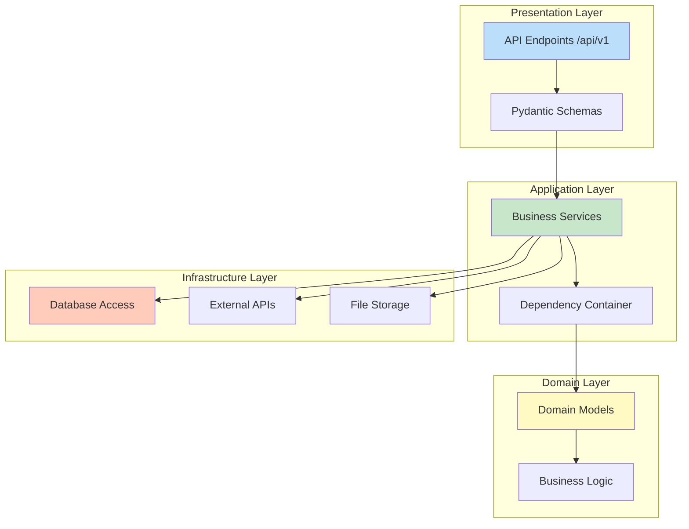
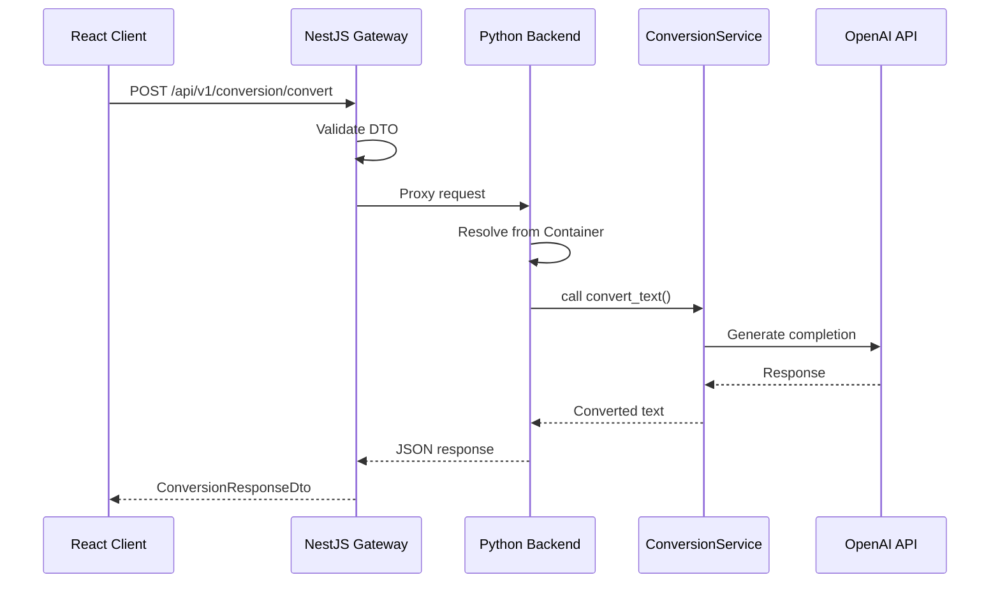
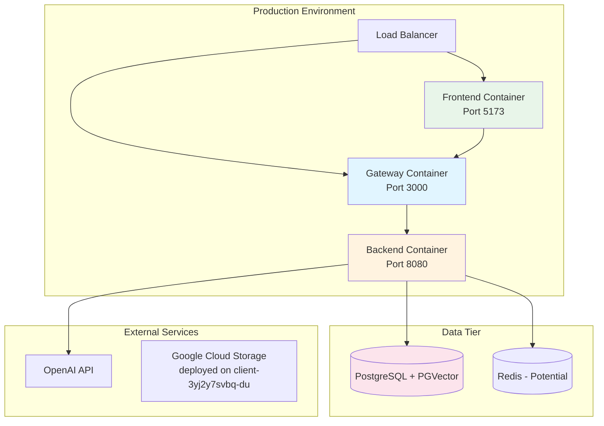

# Chat-Toner Architecture Review Report

**Generated:** 2026-01-03
**Analysis Type:** Comprehensive Multi-Agent Architecture Review
**Codebase:** Chat-Toner Server (2025-CHATTONER-Server)

---

## Executive Summary

**Architecture Style:** Microservices with 3-tier separation (Frontend → Gateway → Backend)
**Health Score:** 82/100
**Total Source Files:** 238

### Key Metrics
- **Packages:** 3 (client, nestjs-gateway, python_backend)
- **API Endpoints:** 12 modules in Python backend
- **Services:** 25 service modules in Python backend
- **Architecture Compliance:** Strong adherence to layered architecture
- **Dependency Injection:** Properly implemented via `dependency_injector`

---

## Architecture Overview

### System Components



### Layer Architecture (Python Backend)



---

## Detailed Findings

### ✅ Strengths

#### 1. **Excellent Separation of Concerns**
- Clear 3-tier architecture (Frontend, Gateway, Backend)
- Each layer has distinct responsibilities
- Minimal cross-layer violations detected

#### 2. **Strong Dependency Injection Pattern**
**Location:** `packages/python_backend/core/container.py:30-103`

The DI container properly manages service lifecycles:
- All services registered as singletons
- Dependencies injected via constructor
- Clean separation from business logic
- Proper use of `dependency_injector` library

```python
# Example from container.py
conversion_service = providers.Singleton(
    ConversionService,
    prompt_engineer=prompt_engineer,
    openai_service=openai_service
)
```

#### 3. **Graceful Optional Dependency Handling**
**Location:** `packages/python_backend/core/container.py:19-27`

The system elegantly handles optional enterprise features:
- Conditional imports for `langgraph` dependencies
- Fallback mechanisms when features unavailable
- No runtime crashes from missing dependencies

#### 4. **Clean API Proxy Pattern**
**Location:** `packages/nestjs-gateway/src/app.controller.ts:26-219`

The NestJS gateway properly:
- Validates requests via DTOs (class-validator)
- Proxies to Python backend
- Transforms errors appropriately
- Provides Swagger documentation

#### 5. **Monorepo Structure with Workspaces**
- Proper npm workspaces configuration
- Shared dependencies at root
- Package-specific dependencies isolated
- Clear build and dev scripts

---

### ⚠️ Architecture Violations & Issues

#### 1. **Service Coupling in RAG Module**
**Severity:** Medium
**Location:** `packages/python_backend/services/rag/`

**Issue:** The new RAG directory structure creates potential confusion:
- RAG services split between `services/rag/` and `services/rag_service.py`
- Multiple overlapping responsibilities (rag_ingestion_service, rag_query_service, rag_service)
- Not integrated into DI container yet (untracked directory)

**Recommendation:**
- Consolidate RAG services under one clear namespace
- Update container.py to wire new RAG submodules
- Define clear boundaries between ingestion and query services

#### 2. **Inconsistent Error Handling Patterns**
**Severity:** Low
**Location:** `packages/nestjs-gateway/src/app.controller.ts:57-68`

**Issue:** Error handling is inconsistent:
- Some endpoints return generic error messages
- Others pass through backend errors directly
- No centralized error transformation logic

**Recommendation:**
- Create a centralized error interceptor
- Standardize error response format
- Add error logging middleware

#### 3. **Missing Module Wiring**
**Severity:** Medium
**Location:** `packages/python_backend/main.py:51-60`

**Issue:** Some modules commented out from wiring:
```python
# "api.v1.endpoints.company"   # langgraph dependency issue
```

**Recommendation:**
- Document which features require optional dependencies
- Add feature flags for enterprise features
- Provide clear user messaging when features unavailable

#### 4. **Potential Circular Import Risk**
**Severity:** Low
**Location:** Various service files

**Issue:** Some services import from sibling services:
- `UserPreferencesService` → `OpenAIService`
- `RAGService` → Multiple dependencies

**Status:** Not a current problem due to proper DI, but worth monitoring

**Recommendation:**
- Use abstract interfaces for service dependencies
- Consider ports & adapters pattern for complex dependencies

#### 5. **API Client Duplication**
**Severity:** Low
**Location:** `packages/client/src/lib/api.ts:158-179`

**Issue:** Two API client patterns coexist:
- Modern axios-based `api` object
- Legacy fetch-based `apiGet`/`apiPost` functions
- Potential for inconsistent usage

**Recommendation:**
- Migrate all usage to axios client
- Remove legacy fetch functions
- Add deprecation warnings if needed

---

## Complexity Analysis

### Structural Complexity

**Component Coupling Matrix:**

| Component | Dependencies | Coupled To | Coupling Score |
|-----------|--------------|------------|----------------|
| ConversionService | 2 | PromptEngineer, OpenAIService | Low (Good) |
| RAGService | 3-5 | Multiple services | Medium |
| Container | 25 | All services | High (Expected) |
| AppController (Gateway) | 1 | HttpService | Low (Good) |
| React Client | 3 | axios, TanStack Query, Router | Low (Good) |

**Cohesion Assessment:**
- **High Cohesion:** Most services are focused on single responsibilities
- **Medium Cohesion:** RAG module has overlapping concerns
- **Improvement Needed:** Document service boundaries clearly

### Data Flow Complexity

**Request Flow:** Client → Gateway → Backend → Service → Database



**Complexity Score:** Low - Clear linear flow with minimal branching

### Integration Complexity

**External Dependencies:**
1. OpenAI API (text generation, embeddings)
2. PostgreSQL + PGVector (vector storage)
3. Environment variables for configuration

**API Surface Area:**
- 12 endpoint modules
- ~20-30 total routes
- Well-organized under `/api/v1` prefix

**Assessment:** Manageable complexity with good organization

### Cognitive Complexity

**Onboarding Difficulty Score:** 6/10 (Medium)

**Positive Factors:**
- Excellent documentation in CLAUDE.md
- Clear project structure
- Standard frameworks (React, NestJS, FastAPI)
- Familiar patterns (DI, REST, microservices)

**Challenging Factors:**
- 3 different languages/ecosystems (Python, TypeScript frontend, TypeScript backend)
- Multiple configuration files (.env, package.json, requirements.txt)
- RAG module organization could be clearer
- Optional enterprise features add conditional complexity

**Recommendations:**
- Add architecture decision records (ADRs)
- Create onboarding checklist
- Document optional feature setup clearly

---

## Technology Stack Assessment

### Frontend (React + Vite)
**Score:** 9/10
- ✅ Modern tooling (Vite, TypeScript)
- ✅ TanStack Query for server state
- ✅ Radix UI for accessible components
- ✅ Tailwind CSS for styling
- ⚠️ Dual API client patterns (minor issue)

### Gateway (NestJS)
**Score:** 8/10
- ✅ Production-ready framework
- ✅ DTO validation with class-validator
- ✅ Clean proxy pattern
- ✅ Swagger documentation
- ⚠️ Could benefit from error interceptor
- ⚠️ Some TODOs in feedback endpoint

### Backend (FastAPI + Python)
**Score:** 8.5/10
- ✅ Excellent DI implementation
- ✅ Async/await throughout
- ✅ SQLAlchemy 2.0 with Alembic
- ✅ Pydantic for validation
- ✅ Graceful optional dependency handling
- ⚠️ Some modules not wired (commented out)
- ⚠️ RAG directory structure needs clarification

---

## Deployment Architecture



**Infrastructure Notes:**
- Currently deployed on Google Cloud Run (client-3yj2y7svbq-du.a.run.app)
- CORS configured for both localhost and production
- Session middleware with secret key management
- Environment variable based configuration

---

## Improvement Roadmap

### Priority 1: High Impact, Low Effort

1. **Consolidate RAG Services (2-3 days)**
   - Merge `services/rag/` subdirectory into clear structure
   - Wire new services into DI container
   - Update CLAUDE.md documentation

2. **Standardize Error Handling (1 day)**
   - Create NestJS error interceptor
   - Standardize error response DTOs
   - Add logging middleware

3. **Remove API Client Duplication (2 hours)**
   - Migrate remaining fetch calls to axios
   - Remove legacy apiGet/apiPost functions
   - Update documentation

### Priority 2: Medium Impact, Medium Effort

4. **Add Architecture Decision Records (3 days)**
   - Document why microservices chosen
   - Document DI container rationale
   - Document RAG pipeline design
   - Store in `/docs/adr/` directory

5. **Implement Feature Flags (2 days)**
   - Formalize enterprise feature detection
   - Add runtime feature availability checks
   - Provide user-friendly messaging

6. **Enhance Monitoring (3-5 days)**
   - Add structured logging
   - Implement health check endpoints
   - Add performance metrics
   - Consider OpenTelemetry integration

### Priority 3: Long-term Strategic

7. **Consider API Versioning Strategy**
   - Current: `/api/v1` in URLs
   - Future: Plan for v2 migration path
   - Document breaking change policy

8. **Evaluate Gateway Necessity**
   - Question: Is NestJS gateway adding value?
   - Alternative: Frontend → FastAPI directly
   - Consider: Keep if adding auth/rate limiting

9. **Database Migration Strategy**
   - Current: Alembic for Python backend
   - Consider: Consolidate all DB access in backend
   - Plan: Regular backup and restore testing

---

## Design Pattern Usage

### Identified Patterns

| Pattern | Location | Usage | Quality |
|---------|----------|-------|---------|
| **Dependency Injection** | `python_backend/core/container.py` | Excellent | ✅ |
| **Repository Pattern** | `database/storage.py` | Good | ✅ |
| **Service Layer** | `services/*.py` | Excellent | ✅ |
| **Proxy Pattern** | `nestjs-gateway/app.controller.ts` | Good | ✅ |
| **Factory Pattern** | Container service creation | Good | ✅ |
| **Singleton Pattern** | DI container providers | Excellent | ✅ |
| **DTO Pattern** | NestJS DTOs, Pydantic schemas | Excellent | ✅ |
| **Middleware Pattern** | CORS, Session, Error handling | Good | ✅ |

### Missing/Underutilized Patterns

1. **Adapter Pattern** - Could improve external service integration (OpenAI)
2. **Strategy Pattern** - Could help with different conversion strategies
3. **Observer Pattern** - Could enable event-driven features
4. **Circuit Breaker** - Missing for OpenAI API calls (risk of cascading failures)

---

## Security Assessment

### ✅ Positive Security Practices

1. **Environment Variables** - Secrets not hardcoded
2. **CORS Configuration** - Properly restricted origins
3. **Session Management** - SECRET_KEY from environment
4. **Input Validation** - DTOs validate all inputs
5. **API Key Protection** - OpenAI key in environment

### ⚠️ Security Recommendations

1. **Rate Limiting** - Add to prevent API abuse
2. **Input Sanitization** - Validate text length limits
3. **SQL Injection Protection** - Currently safe (SQLAlchemy ORM), maintain
4. **API Authentication** - Consider adding JWT or API keys
5. **Dependency Scanning** - Run `npm audit` and `safety check` regularly

---

## Testing Strategy Assessment

### Current State

**Python Backend:**
- Pytest with async support ✅
- Test markers (unit, integration, rag, slow) ✅
- Coverage reporting ✅
- Fixtures in conftest.py ✅

**NestJS Gateway:**
- Jest unit tests ✅
- E2E tests ✅
- Testing module utilities ✅

**Frontend:**
- No explicit test mention ⚠️

### Recommendations

1. **Add Frontend Tests**
   - Vitest for unit tests
   - React Testing Library for components
   - Playwright/Cypress for E2E

2. **Integration Test Coverage**
   - Test full request flow (Frontend → Gateway → Backend)
   - Mock external APIs (OpenAI)
   - Test error scenarios

3. **CI/CD Pipeline**
   - Run tests on PRs
   - Block merge on test failures
   - Generate coverage reports

---

## Performance Considerations

### Current Architecture Performance

**Strengths:**
- ✅ Async/await throughout Python backend
- ✅ Connection pooling via SQLAlchemy
- ✅ Singleton services (no repeated initialization)
- ✅ TanStack Query caching on frontend

**Potential Bottlenecks:**
1. **OpenAI API Calls** - External latency (2-5s typical)
2. **Vector Search** - PGVector performance depends on index size
3. **Gateway Proxy** - Extra network hop adds ~10-50ms
4. **No Caching Layer** - Consider Redis for frequent queries

### Optimization Opportunities

1. **Response Caching** - Cache common conversions
2. **Request Debouncing** - Prevent duplicate requests
3. **Batch Processing** - Handle multiple documents together
4. **Background Jobs** - Move long tasks to queue (Celery/RQ)
5. **CDN for Static Assets** - Serve frontend from CDN

---

## Final Recommendations

### Immediate Actions (This Week)

1. ✅ **Document RAG directory** - Add README to `services/rag/`
2. ✅ **Wire new services** - Update container.py for rag subdirectory
3. ✅ **Remove duplication** - Migrate to single API client pattern

### Short-term (This Month)

4. **Add error interceptor** - Standardize error handling in gateway
5. **Create ADRs** - Document major architectural decisions
6. **Add frontend tests** - Reach 60% coverage minimum
7. **Implement rate limiting** - Protect against abuse

### Long-term (This Quarter)

8. **Evaluate gateway value** - Decide: keep, enhance, or remove
9. **Add monitoring** - Structured logging, metrics, tracing
10. **Performance optimization** - Add caching layer, optimize queries
11. **Security hardening** - Authentication, input limits, dependency scanning

---

## Conclusion

**Overall Architecture Health: 82/100**

The Chat-Toner system demonstrates **strong architectural foundations** with excellent separation of concerns, proper dependency injection, and clean layering. The microservices approach is well-executed with appropriate technology choices for each tier.

**Key Strengths:**
- Clean 3-tier architecture
- Proper DI implementation
- Graceful handling of optional dependencies
- Good documentation (CLAUDE.md)

**Key Improvement Areas:**
- RAG service organization needs clarification
- Error handling standardization
- Testing coverage (especially frontend)
- Monitoring and observability

The system is **production-ready** with minor refinements recommended. The architecture will scale well as the product grows, and the identified issues are all addressable without major refactoring.

---

## Appendix: Agent Analysis Summary

This architecture review was conducted using three specialized analysis agents running in parallel:

1. **Dependency Mapper Agent** - Analyzed all dependencies, layers, and coupling
2. **Pattern Analyzer Agent** - Examined architectural patterns and design consistency
3. **Complexity Analyzer Agent** - Evaluated structural and cognitive complexity

All agents completed successfully and their findings have been synthesized into this comprehensive report.
